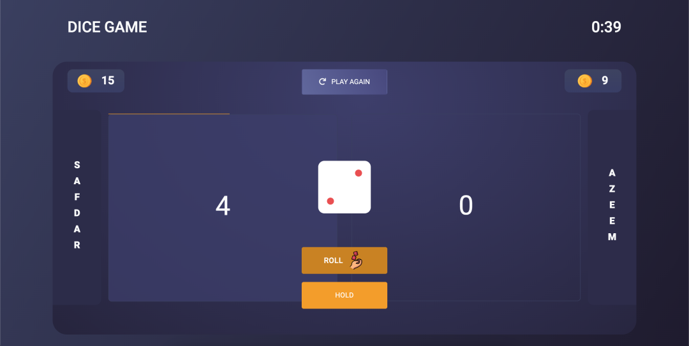

# Ludo Game

This is a simple implementation of the classic board game Ludo using HTML, CSS, and JavaScript. The game features two players who take turns rolling a dice and moving their pieces around the board. The first player to move all their pieces to the finish line wins the game.

## Features

-   Players can enter their names to start the game.
-   Three difficulty modes: Easy, Medium, and Hard.
-   Timer to track the game duration.
-   Progress bars to visualize player turns.
-   Winner dashboard to display the winner's name.

## How to Play

1. Enter the names of Player 1 and Player 2.
2. Select the difficulty mode.
3. Roll the dice to move your pieces.
4. Hold to end your turn and update your score.
5. The game ends when one player reaches the finish line or the timer runs out.
